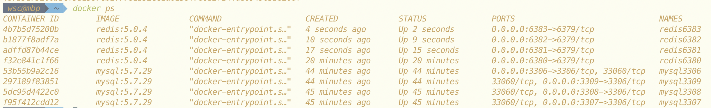
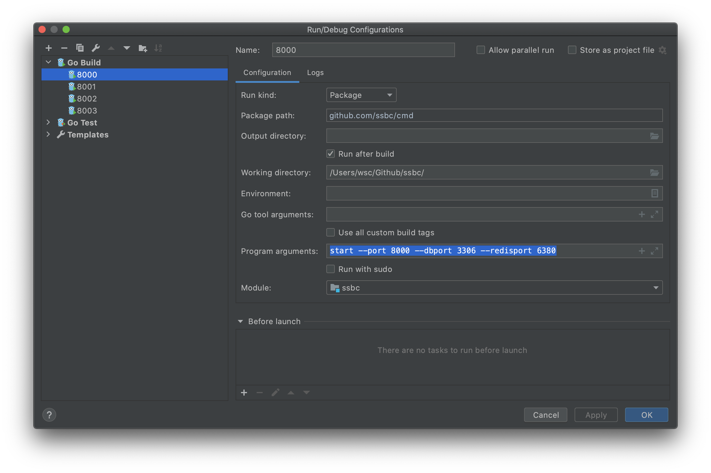

## dev分支 4节点启动过程

* docker运行4个MySQL，4个Redis

```shell
# Mysql
docker run --name mysql3306 -p 3306:3306 -e MYSQL_ROOT_PASSWORD=123456 -d mysql:5.7.29
docker run --name mysql3307 -p 3307:3306 -e MYSQL_ROOT_PASSWORD=123456 -d mysql:5.7.29
docker run --name mysql3308 -p 3308:3306 -e MYSQL_ROOT_PASSWORD=123456 -d mysql:5.7.29
docker run --name mysql3309 -p 3309:3306 -e MYSQL_ROOT_PASSWORD=123456 -d mysql:5.7.29
    
# Redis
docker run --name redis6380 -p 6380:6379 -d redis:5.0.4
docker run --name redis6381 -p 6381:6379 -d redis:5.0.4
docker run --name redis6382 -p 6382:6379 -d redis:5.0.4
docker run --name redis6383 -p 6383:6379 -d redis:5.0.4
```



* 设置运行配置

```
start --port 8000 --dbport 3306 --redisport 6380
start --port 8001 --dbport 3307 --redisport 6381
start --port 8002 --dbport 3308 --redisport 6382
start --port 8003 --dbport 3309 --redisport 6383
```



* 启动4个节点后，使用浏览器或Postman访问 http://localhost:8000/mockClient

    

